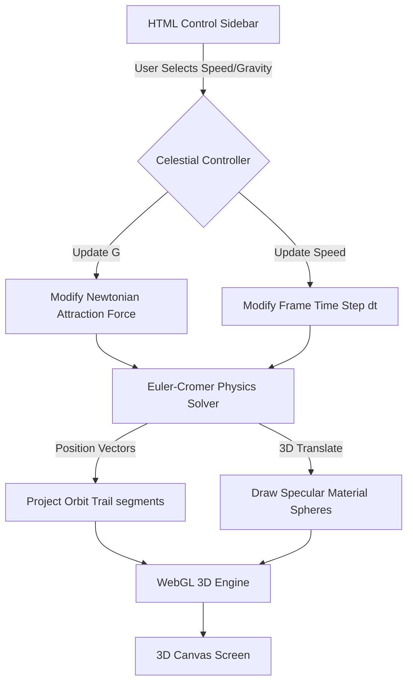

# 3D Keplerian Planetary Orrery 🪐✨

A premium, interactive browser-based 3D Solar System simulator modeling orbital physics.

Built with **p5.js** and HTML5/CSS3. It features 3D WebGL rendering, procedural lighting shaders, orbital trail projections, and Newtonian vector integrations.

---

## 🎨 Interactive Features

*   **Newtonian Vector Physics**: Integrates positions, velocities, and gravitational forces at each clock cycle using Euler-Cromer calculations:
    *   `F_g = -G · (M·m / r²) · r̂`
*   **3D WebGL Viewport**: Drag your mouse directly on the canvas to rotate the camera around the Solar System, or use the scroll wheel to zoom in and out.
*   **Procedural Point Lighting**: The Sun acts as an active point light source, illuminating the facing hemispheres of orbiting planets with specular highlights, casting their dark sides in shadow.
*   **Keplerian Trail Rings**: Generates glowing 3D vector rings that trace the historical path of each planet.
*   **Gravity & Speed Customization**: Speed up time (up to 10x) or adjust the Gravitational Constant ($G$). Tweak $G$ in real-time to watch orbits warp, collapse, or escape.

---

## 📊 System Architecture Diagram



---

## 🚀 How to Run
1. Clone the repository:
   ```bash
   git clone https://github.com/shubhamkrshandilya/planetarymotion.git
   ```
2. Open `index.html` in any web browser to run the simulation immediately!
